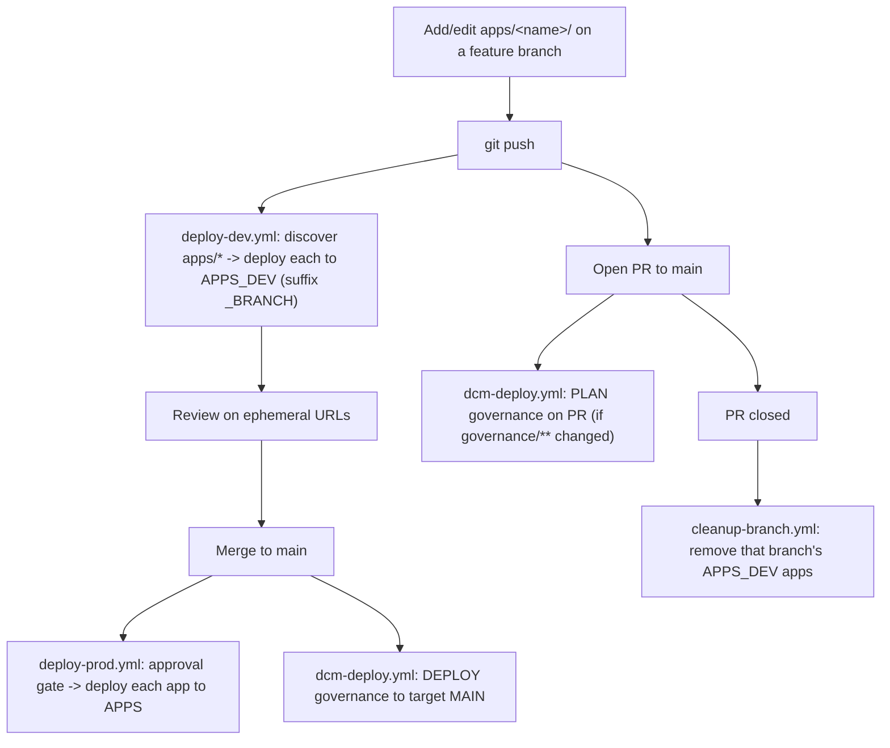

# Snowflake Apps Framework — Ski Resort Demo

A **monorepo framework** for building and shipping multiple Snowflake apps with
[Cortex Code Desktop](https://docs.snowflake.com/en/user-guide/cortex-code/cortex-code).
Teams drop a new app under `apps/<name>/`, push a branch, and CI automatically
deploys it — no pipeline edits. It's approachable for people who have **never
used an IDE** (if you've used Claude / Cowork, you can do this) but it scales to
a team of engineers shipping many apps.

It ships with **two example apps** that render the same read-only "Daily Resort
KPI" dashboard, proving one deploy loop works for either framework:

| App | Framework | What it is |
|-----|-----------|------------|
| `apps/nextjs-dashboard` | Next.js (Snowflake App Runtime) | A full web app running on Snowflake (SPCS) |
| `apps/streamlit-dashboard` | Streamlit in Snowflake | A Python dashboard |
| `apps/_template-streamlit` | (starter) | Copy to begin a Streamlit app — never deployed |
| `apps/_template-nextjs` | (starter) | Node.js / App Runtime starter (use `/snowflake-apps`) — never deployed |

## The big idea: environments at the app layer

There is **one** read-only data database, `SKI_RESORT_DEMO`. Because the data is
identical everywhere, environments are **not** separate databases — they're just
*where an app object is deployed*:

| Environment | Schema | App object name | Who triggers it |
|-------------|--------|-----------------|-----------------|
| feature branch | `APPS_DEV` | `<APP>_<BRANCH>` | push a branch |
| production | `APPS` | `<APP>` | merge to `main` + approval |

The `apps/` folder is the **registry**: CI scans it, reads each app's type
(`snowflake-app` vs `streamlit`), and deploys each one. Adding `apps/<your-app>/`
requires **zero** workflow changes.

## How a change flows



See [docs/ARCHITECTURE.md](docs/ARCHITECTURE.md) for the full architecture and
maintenance model.

## Build with Cortex Code

Cortex Code Desktop has built-in **skills** that scaffold, deploy, and operate
these apps. In the CoCo chat:

| Skill | What it does |
|-------|--------------|
| `/build-app` | Start a brand-new Snowflake app; helps pick the framework. |
| `/snowflake-apps` | Scaffold, run locally, **deploy**, and troubleshoot App Runtime (Next.js) apps. |

## What's in the box

```
.
├── docs/
│   ├── ONBOARDING.md       ← START HERE (first deploy, step by step)
│   ├── ARCHITECTURE.md     ← framework + flow + maintenance model
│   ├── PIPELINE_SETUP.md   ← wire up GitHub Actions (secrets/vars/environments)
│   └── TEARDOWN.md
├── apps/
│   ├── nextjs-dashboard/     ← example: Snowflake App Runtime (Node.js)
│   ├── streamlit-dashboard/  ← example: Streamlit in Snowflake
│   ├── _template-streamlit/  ← Streamlit starter (not deployed)
│   └── _template-nextjs/     ← App Runtime starter -> /snowflake-apps (not deployed)
├── governance/             ← DCM project: roles, warehouse, schemas, grants
├── .github/
│   ├── workflows/          ← deploy-dev, deploy-prod, cleanup-branch, dcm-deploy
│   └── CODEOWNERS          ← platform owns .github + governance; teams own apps/*
├── scripts/teardown.sh
├── AGENTS.md               ← guidance for AI tools (use /build-app, /snowflake-apps)
└── CONTRIBUTING.md         ← add a new app in a few steps
```

## Add a new app

**Preferred — use the Cortex Code skills** (they scaffold a full project and
wire up local preview):

- `/build-app` — describe your app; it picks the framework and routes to the
  right create skill.
- `/snowflake-apps` — go straight to a Node.js / App Runtime app.
- the Streamlit-in-Snowflake skill — for a Python dashboard.

**Manual / offline fallback** — copy a starter:

```bash
cp -r apps/_template-streamlit apps/my-app      # Python (Streamlit)
# or see apps/_template-nextjs/README.md         # Node.js (App Runtime)
# edit apps/my-app/snowflake.yml (rename MY_APP) and build your app
git checkout -b my-app && git add apps/my-app && git commit -m "add my-app" && git push -u origin my-app
```

Pushing deploys it to `APPS_DEV`; merging to `main` ships it to `APPS`. Full
steps in [CONTRIBUTING.md](CONTRIBUTING.md); AI-agent guidance in
[AGENTS.md](AGENTS.md).

## Quick start

New here? Open **[docs/ONBOARDING.md](docs/ONBOARDING.md)**.

Already set up? The loop:

```bash
# 1. Governance (roles, warehouse, APPS/APPS_DEV schemas, grants) — one time
snow dcm deploy SKI_RESORT_DEMO.PUBLIC.SKI_GOVERNANCE --target MAIN

# 2. Ship the apps (defaults deploy to APPS_DEV with the _DEV suffix)
cd apps/nextjs-dashboard && snow app deploy
cd ../streamlit-dashboard && snow streamlit deploy
```

To run the pipeline in GitHub, wire up secrets/variables/environments per
[docs/PIPELINE_SETUP.md](docs/PIPELINE_SETUP.md).
