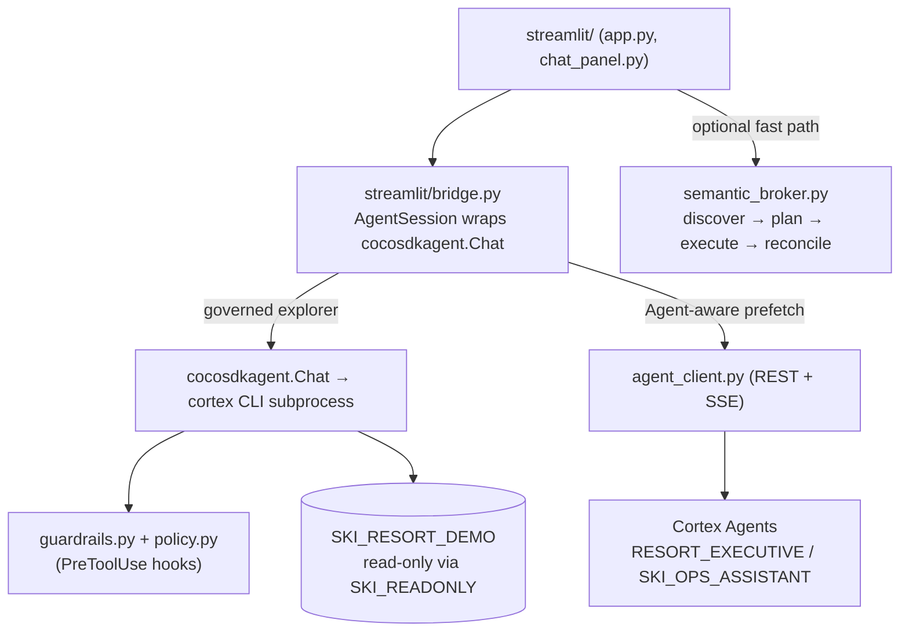

# cortex-code-agent

The **governed AI brain** behind the Ski Resort BI chat. The Streamlit UI lives
in [`../streamlit/`](../streamlit/); this package is the policy, guardrails, and
clients that let the chat answer questions about the data **safely** (read-only)
and **richly** (text + tables + charts).

> Import note: the folder is `cortex-code-agent/` (hyphen) but it's imported as
> the Python package `cortex_code_agent` — `streamlit/_bootstrap.py` aliases the
> hyphenated directory at startup. It is **committed** (part of the public
> template), not local-only.

---

## How it fits the app



The chat has **two answer engines** and a small **REST client**:

1. **Governed SDK explorer** (primary) — `cocosdkagent.Chat` runs its own
   `sql_execute` loop against the read-only data, under the guardrails in this
   package. Driven from `streamlit/bridge.py`. The SDK's transport spawns the
   `cortex` CLI as a subprocess; we never call the CLI directly.
2. **Cortex Agents REST client** — `agent_client.py` calls the deployed Cortex
   Agents over REST+SSE. In the chat's **Agent-aware** mode, the explorer
   pre-fetches an agent answer as a trusted baseline, then enhances it.
3. **Deterministic broker** (optional fast path) — `semantic_broker.py` is a
   rule-based pipeline (discover assets → plan evidence → run providers →
   reconcile) for canned dashboard questions, with no LLM orchestration.

---

## The Agent-aware turn, end to end

This is the most important flow in the app: when **Agent-aware** mode is on, the
chat consults the deployed Cortex Agent as a trusted baseline and the SDK
explorer enhances it. (File:line references are to `streamlit/chat_panel.py`
unless noted.)

```
User types a question in the Chat tab
        │  _render_chat()  reads settings["fast_path"]            (chat_panel.py:400)
        ▼
   fast_path ON?
   ├── YES → _run_fast_path() → semantic_broker.run_semantic_turn()   (deterministic; default OFF)
   └── NO  → _run_explorer_turn(prompt)   ← the orchestrator
                │  prompt_mode = settings["prompt_mode"]            (chat_panel.py:284)
                │
        ┌───────┴────────┐
        │ explore        │ agent-aware
        │ (no agent)     │
        │                ▼
        │   STEP 1 — PRE-FETCH THE AGENT (trusted baseline)        (chat_panel.py:296)
        │     _prefetch_agent(prompt, status)
        │       history = st.session_state["agent_history"]        (:244  ← memory, cap 12 msgs)
        │       resp = call_cortex_agent(
        │           prompt, agent_fqn=RESORT_EXECUTIVE,
        │           connection=EXPLORER_CONNECTION (read-only role),
        │           history=history, timeout=180)                  (:246-248)
        │            │  REST + SSE (no ~10s sql_execute cap)
        │            ▼  agent_client.py:call_cortex_agent()
        │       _build_payload() injects prior turns → messages[]  (agent_client.py:106/120)
        │            │  → AgentResponse: text + dataframes + chart_specs (Vega) + usage
        │            ▼
        │       append {user, assistant} to agent_history (cap 12) (:259-262)
        │                │ agent_ev (provider="agent") + its tables/charts
        │                ▼
        │   STEP 2 — BUILD AUGMENTED PROMPT
        │     explorer_prompt = prompt
        │       + "[RESORT_EXECUTIVE agent answer]\n{answer}\n..."
        │       + "enhance it with a deeper breakdown"
        └────────┬───────┘
                 ▼
   STEP 3 — SDK EXPLORER (enhancement / sole answerer in explore mode)
     session.send_events(explorer_prompt)                          (bridge.py:send_events → :180 chat.stream())
       cocosdkagent.Chat keeps its OWN conversation memory across turns
       each tool call → PreToolUse hooks  (bridge.py:connect):
         • block_tools(BLOCKED_TOOLS)        (task/Bash/Write… denied)   (:131)
         • sql_read_only_guard()                                         (:132)
         • scope_guard(SCOPE_DATABASES)      (SHOW AGENTS / out-of-db rejected) (:134)
       sql_execute → Snowflake (read-only role, fast aggregation queries)
                 ▼
   STEP 4 — RENDER  _render_explore_message(msg)
     "Resort Executive Agent:"  → agent baseline text   (agent-aware only)
     ──── divider ────
     "Explorer enhancement:"    → explorer text
     + result TABLES and CHARTS (agent Vega chart_specs/dataframes + explorer auto-charts,
       gated by the "Show charts" toggle)
     + Evidence expander + "[Agent-aware · consulted agent]" usage badge
```

**Two independent memories:** `agent_history` (carried by us, replayed into the
REST agent because its `:run` is stateless) and the `cocosdkagent.Chat`'s own
thread (persisted in `st.session_state` via `get_or_create_session`). In
**explore** mode STEP 1–2 are skipped and the explorer answers directly from the
marts.

---

## Defense-in-depth guardrails

The explorer is constrained at four layers, strongest first:

| Layer | Mechanism | Where |
|-------|-----------|-------|
| 1. **Read-only role** (primary) | The explorer always connects via `EXPLORER_CONNECTION = "ski_readonly"`; its grants physically prevent writes. | `policy.py` |
| 2. **Blocked tools** | A `PreToolUse` hook (`block_tools(BLOCKED_TOOLS)`) rejects write/escape tools — `Write/Edit/Bash`, **and crucially `task/team/cron`** (sub-agents would run bash *outside* these hooks and explode token cost) plus `web_*`, `skill`, repl, etc. | `policy.BLOCKED_TOOLS`, applied in `bridge.py` |
| 3. **SQL scope guard** | `scope_guard(SCOPE_DATABASES)` blocks any `sql_execute` referencing a database outside `{SKI_RESORT_DEMO, SNOWFLAKE}`, and blocks account-wide discovery (`IN ACCOUNT`, `SHOW AGENTS`) that leaks other tenants' objects. | `guardrails.py` |
| 4. **Cost containment** | `MAX_EXPLORER_ROWS`, `DEFAULT_MAX_TURNS = 8`, `DEFAULT_EFFORT = "medium"`. | `policy.py` |

> Why the tool **allowlist is empty** (`ALLOWED_TOOLS = []`): the CLI's
> `--allowed-tools` flag empirically fails to match `sql_execute` and blocks the
> explorer's primary tool. So we leave the allowlist empty and enforce via the
> callback-level `PreToolUse` hooks above, which are reliable.

---

## A/B explorer prompt modes

`load_system_prompt(mode)` returns one of two system prompts (toggled in the
chat's Settings tab):

| Mode | Prompt file | Behavior |
|------|-------------|----------|
| `explore` (default) | `system_prompt_explore.md` | Knows only the marts; answers purely via `sql_execute`. |
| `agent` | `system_prompt_agent.md` | Also knows the deployed Cortex Agent + the `DATA_AGENT_RUN` accelerator recipe; the chat pre-fetches the agent's answer and the explorer enhances it. |

`system_prompt.md` is a legacy single-prompt fallback used only if a mode file is
missing.

---

## Cortex Agents registry + REST client

`CORTEX_AGENTS` (in `policy.py`) is the catalogue the UI exposes as toggles:

| Key | FQN | Focus |
|-----|-----|-------|
| `resort_executive` (default) | `SKI_RESORT_DEMO.AGENTS.RESORT_EXECUTIVE` | Broad executive BI: revenue, KPIs, customers, weather, ops, marketing, safety. |
| `ski_ops_assistant` | `SKI_RESORT_DEMO.AGENTS.SKI_OPS_ASSISTANT` | Operations: lift waits, maintenance, grooming, staffing, safety. |

`call_cortex_agent(...)` (`agent_client.py`) POSTs to the agent `:run` endpoint
and parses the SSE stream into an **`AgentResponse`** with `text`, `sql_queries`,
**`dataframes`** (result tables), **`chart_specs`** (Vega-Lite — rendered as
charts in the chat), `citations`, token usage, and `thread_id`. Auth is
`KEYPAIR_JWT` minted from `~/.snowflake/connections.toml` by `_jwt_auth.py` (no
password; short-lived, cached JWT).

---

## Deterministic broker (fast path)

`semantic_broker.run_semantic_turn()` is a non-LLM pipeline for dashboard
questions:

```
classify_prompt → discover_all → plan_evidence → run_provider(...) → reconcile → BIAnswer
```

- `evidence_planner.py` — classifies intent (revenue/visitation/ops/weather/…)
  and plans which evidence paths to run.
- `discovery.py` — fast metadata scouts (`discover_agents`, `discover_semantic_views`,
  `discover_tables`, `discover_process_context`).
- `providers.py` — executes each evidence step (`semantic`, governed `sql`,
  `agent`, `process`) and returns an `EvidenceResult`.
- `reconciler.py` — merges results into one `BIAnswer` (with currency-safe
  summaries that won't trip Markdown/LaTeX).
- `evidence.py` — the shared dataclasses (`DiscoveryResult`, `PromptIntent`,
  `EvidenceStep`, `EvidenceResult`, `BIAnswer`, asset types).

---

## File map

| File | Purpose |
|------|---------|
| `policy.py` | The single source of policy: blocked tools, model/turns/effort, `EXPLORER_CONNECTION`, `SCOPE_DATABASES`, `MAX_EXPLORER_ROWS`, the `CORTEX_AGENTS` registry, prompt-mode loading. |
| `guardrails.py` | `scope_guard()` — the SQL database-scope + account-wide-discovery `PreToolUse` guard. |
| `agent_client.py` | Cortex Agents REST+SSE client → `AgentResponse` (text, dataframes, chart specs, usage). Has a CLI smoke test. |
| `_jwt_auth.py` | `KEYPAIR_JWT` minting + caching from `connections.toml`. |
| `exploration_tools.py` | `list_semantic_views` / `describe_semantic_view` — due-diligence helpers. |
| `semantic_broker.py` | The deterministic discover→plan→execute→reconcile pipeline. |
| `discovery.py` · `evidence_planner.py` · `providers.py` · `reconciler.py` · `evidence.py` | The broker's stages + shared dataclasses. |
| `system_prompt_explore.md` · `system_prompt_agent.md` · `system_prompt.md` | The A/B system prompts (+ legacy fallback). |
| `__init__.py` | Public re-exports (`call_cortex_agent`, `CORTEX_AGENTS`, `EXPLORER_CONNECTION`, `load_system_prompt`, `run_semantic_turn`, …). |

---

## Retarget to a different database / agents

Everything points at the demo data via `policy.py`. To reuse this against your
own data:

1. Change `SKI_RESORT_DATABASE`, `SKI_RESORT_SEMANTIC_SCHEMA`, and the
   `CORTEX_AGENTS` FQNs in `policy.py`.
2. Update `SCOPE_DATABASES` if your data lives in a different database.
3. Point `EXPLORER_CONNECTION` at a read-only connection in your
   `connections.toml` (the container's `entrypoint.sh` writes one from the
   mounted key-pair secret).

The agents + semantic views must be reachable by that read-only role — see
[`../setup.sql`](../setup.sql) step 10 for the semantic-view repoint, and
[`../../../governance/README.md`](../../../governance/README.md) for the grants.

---

## Try the REST client standalone

```bash
SNOWFLAKE_CONNECTION_NAME=myconnection \
  python cortex-code-agent/agent_client.py \
  --agent SKI_RESORT_DEMO.AGENTS.RESORT_EXECUTIVE \
  "What is total ticket revenue for the 2024-2025 season?" --verbose
```

Prints the agent's text, tool/SQL counts, dataframes, and token usage — handy
for verifying connectivity + JWT auth without the Streamlit UI.
