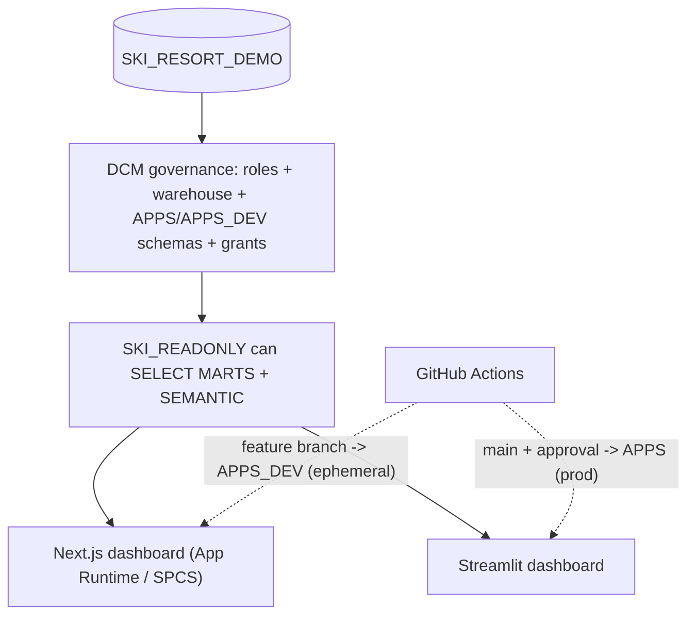
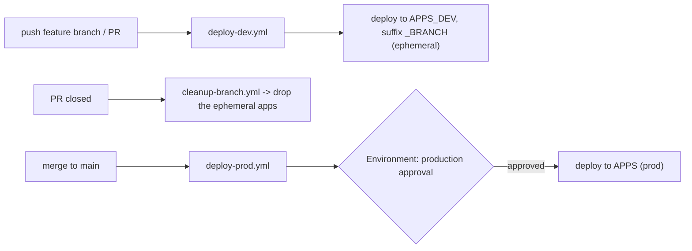

# Architecture

This template is deliberately small but shows a complete, production-shaped
workflow. The key idea: the data is **one read-only copy**, so environments
live at the **app layer**, not the data layer.



## 1. Data

The dashboards read from a ready-to-go ski-resort analytics dataset in the
single `SKI_RESORT_DEMO` database (a dimensional model in `MARTS` plus Cortex
Analyst semantic views in `SEMANTIC`). The data is already provisioned; the
apps simply read from it.

There is **one** data copy shared by every environment. Because the data is
read-only and identical everywhere, there is no per-environment data database —
this is what lets environments collapse onto the app layer.

## 2. Governance: DCM (infrastructure as code)

The [`governance/`](../governance) directory is a single DCM project. It
**declaratively manages** everything *around* the data — it does not redefine
the data tables or semantic views. It defines:

- **Warehouse** `SKI_DEMO_WH` — one shared XS warehouse for all app instances.
- **Three account roles** with inheritance (no environment suffix):

  ```mermaid
  graph TD
    SYSADMIN[SYSADMIN] --> ADMIN["SKI_ADMIN"]
    ADMIN --> DEVELOPER["SKI_DEVELOPER"]
    DEVELOPER --> READONLY["SKI_READONLY"]
  ```

- **Two app schemas** in the database:
  - `APPS` — production app objects (consumers use these).
  - `APPS_DEV` — dev + ephemeral feature-branch app objects.
- **Grants**: read-only `SELECT` + `USAGE` on `MARTS` and `SEMANTIC` (current and
  **future** objects), warehouse `USAGE`, developer `CREATE` on both app schemas,
  and the role-to-user assignment that makes onboarding "just work".

Roles are **account-level** (not database roles) because warehouse `USAGE` cannot
be granted to a database role.

### Environments

There is **one** database and **one** governance project (target `MAIN` in
[`governance/manifest.yml`](../governance/manifest.yml)). Environments differ
only by *where an app object is deployed*:

| Environment        | Schema     | App name suffix      |
| ------------------ | ---------- | -------------------- |
| local / default    | `APPS_DEV` | `_DEV`               |
| ephemeral branch   | `APPS_DEV` | `_<BRANCH>` (CI)     |
| production         | `APPS`     | _(none)_ (CI)        |

The app `snowflake.yml` exposes `app_schema` and `app_suffix` as templating
variables; CI overrides them with `--env` (no file edits / no `sed`).

## 3. Apps: two frameworks, one result

Both apps query the data read-only and render the same Daily Resort KPIs
(visits, unique visitors, visits/guest, pass-holder %, weekend share, snow
conditions) sourced from `SEM_DAILY_SUMMARY` and `FACT_PASS_USAGE` + `DIM_DATE`.
Both hardcode the single data database `SKI_RESORT_DEMO`.

- [`apps/nextjs-dashboard`](../apps/nextjs-dashboard) — Snowflake App Runtime
  (Next.js), deployed with `snow app deploy` to SPCS.
- [`apps/streamlit-dashboard`](../apps/streamlit-dashboard) — Streamlit in
  Snowflake, deployed with `snow streamlit deploy`.

The point is the **shared deploy loop**: the same `snow … deploy` ships either app.

## 4. CI/CD: GitHub Actions

CI deploys **only the apps** via the official
[`snowflakedb/snowflake-cli-action`](https://github.com/snowflakedb/snowflake-cli-action).
DCM governance is one-time setup (see ONBOARDING.md), so the pipeline stays fast
and focused on shipping app changes.



- **Feature branches / PRs** auto-deploy their **own** throwaway copy of both
  dashboards into `APPS_DEV`, named with a sanitized branch slug. Each branch
  gets isolated services and URLs.
- **PR close** triggers `cleanup-branch.yml`, which removes that branch's apps so
  dev objects don't pile up.
- **PROD** only deploys from `main`, and only after a required reviewer approves
  the `production` GitHub Environment. This is the "prod is locked down" control.
- Authentication uses **key-pair** credentials (`SNOWFLAKE_PRIVATE_KEY_RAW`) via
  a temporary connection (`-x`) — no interactive login, no config.toml in CI.

> Endpoint URLs are assigned by Snowflake (`<hash>-<org>-<account>.snowflakecomputing.app`)
> and are not customizable; a vanity domain requires PrivateLink + your own DNS.

## Teardown

To remove what this template created (the ephemeral branch apps, the production
apps, or the full governance), see [TEARDOWN.md](TEARDOWN.md).
