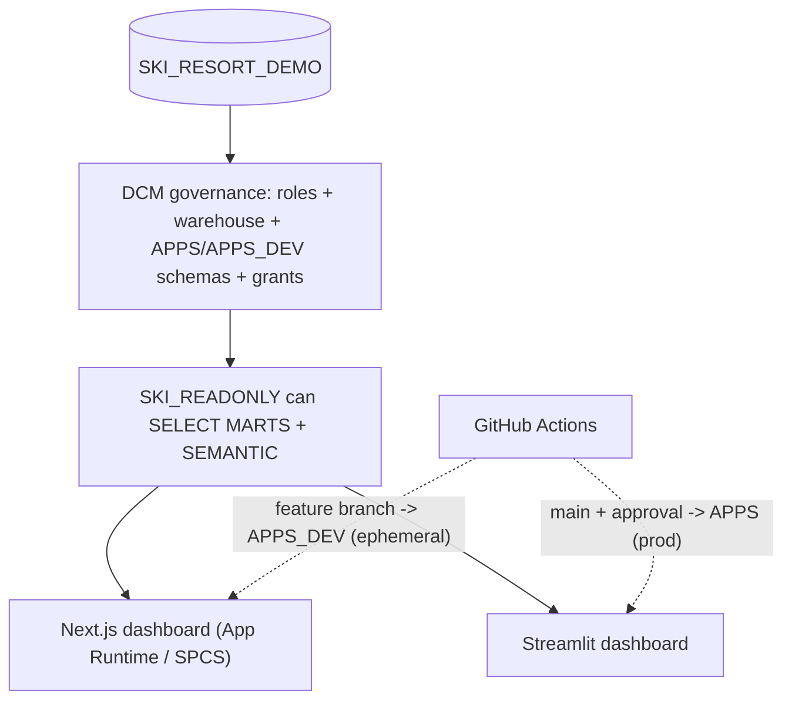
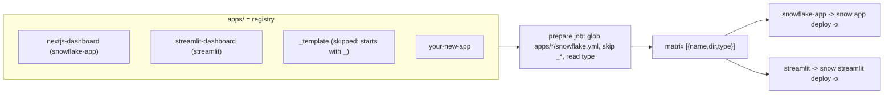
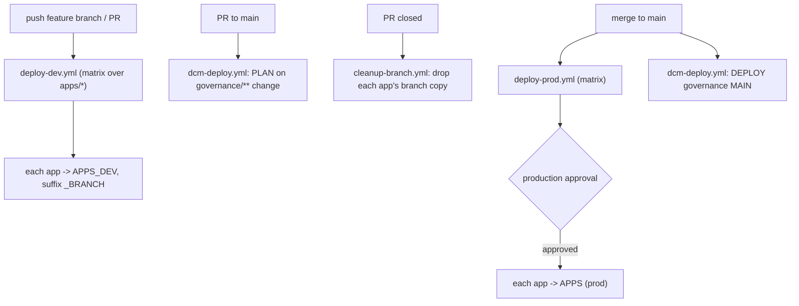

# Architecture

This template is deliberately small but shows a complete, production-shaped
workflow. The key idea: the data is **one read-only copy**, so environments
live at the **app layer**, not the data layer.



## 1. Data

The dashboards read from a ready-to-go ski-resort analytics dataset in the
single `SKI_RESORT_DEMO` database (a dimensional model in `MARTS` plus Cortex
Analyst semantic views in `SEMANTIC`). The data is already provisioned; the
apps simply read from it.

There is **one** data copy shared by every environment. Because the data is
read-only and identical everywhere, there is no per-environment data database —
this is what lets environments collapse onto the app layer.

## 2. Governance: DCM (infrastructure as code)

The [`governance/`](../governance) directory is a single DCM project. It
**declaratively manages** everything *around* the data — it does not redefine
the data tables or semantic views. It defines:

- **Warehouse** `SKI_DEMO_WH` — one shared XS warehouse for all app instances.
- **Three account roles** with inheritance (no environment suffix):

  ```mermaid
  graph TD
    SYSADMIN[SYSADMIN] --> ADMIN["SKI_ADMIN"]
    ADMIN --> DEVELOPER["SKI_DEVELOPER"]
    DEVELOPER --> READONLY["SKI_READONLY"]
  ```

- **Two app schemas** in the database:
  - `APPS` — production app objects (consumers use these).
  - `APPS_DEV` — dev + ephemeral feature-branch app objects.
- **Grants**: read-only `SELECT` + `USAGE` on `MARTS` and `SEMANTIC` (current and
  **future** objects), warehouse `USAGE`, developer `CREATE` on both app schemas,
  and the role-to-user assignment that makes onboarding "just work".

Roles are **account-level** (not database roles) because warehouse `USAGE` cannot
be granted to a database role.

### Environments

There is **one** database and **one** governance project (target `MAIN` in
[`governance/manifest.yml`](../governance/manifest.yml)). Environments differ
only by *where an app object is deployed*:

| Environment        | Schema     | App name suffix      |
| ------------------ | ---------- | -------------------- |
| local / default    | `APPS_DEV` | `_DEV`               |
| ephemeral branch   | `APPS_DEV` | `_<BRANCH>` (CI)     |
| production         | `APPS`     | _(none)_ (CI)        |

The app `snowflake.yml` exposes `app_schema` and `app_suffix` as templating
variables; CI overrides them with `--env` (no file edits / no `sed`).

## 3. Apps: a registry of many apps

The `apps/` folder is a **registry**. Each subfolder is one app with its own
`snowflake.yml`; CI discovers them all. Adding `apps/<your-app>/` ships a new app
with no pipeline changes (see [CONTRIBUTING.md](../CONTRIBUTING.md)).



The two example apps query the data read-only and render the same Daily Resort
KPIs (visits, unique visitors, visits/guest, pass-holder %, weekend share, snow
conditions) from `SEM_DAILY_SUMMARY` and `FACT_PASS_USAGE` + `DIM_DATE`. Both
hardcode the single data database `SKI_RESORT_DEMO`.

- [`apps/nextjs-dashboard`](../apps/nextjs-dashboard) — Snowflake App Runtime
  (Next.js), `snow app deploy` to SPCS.
- [`apps/streamlit-dashboard`](../apps/streamlit-dashboard) — Streamlit in
  Snowflake, `snow streamlit deploy`.
- [`apps/_template`](../apps/_template) — copy-me starter; the `_` prefix keeps
  it out of CI.

The point is the **shared deploy loop**: one matrix ships every app, either framework.

## 4. CI/CD: GitHub Actions

Four workflows, all using the official
[`snowflakedb/snowflake-cli-action`](https://github.com/snowflakedb/snowflake-cli-action)
to install the CLI, followed by a `snow connection test -x` sanity check.
Credentials use the **secrets vs variables** split (sensitive values masked,
role/db/warehouse as readable variables) — see
[PIPELINE_SETUP.md](PIPELINE_SETUP.md).



- **Feature branches / PRs**: `deploy-dev.yml` discovers every app and deploys
  each to `APPS_DEV` with a sanitized branch suffix — isolated services + URLs.
- **PR close**: `cleanup-branch.yml` removes that branch's apps.
- **PROD**: `deploy-prod.yml` deploys from `main` only, behind the `production`
  GitHub Environment approval gate.
- **Governance**: `dcm-deploy.yml` plans on PRs touching `governance/**` and
  deploys target `MAIN` on merge (it connects as `ACCOUNTADMIN`).
- Auth: key-pair via a temporary connection (`-x`) for apps; the nested
  `SNOWFLAKE_CONNECTIONS_DEFAULT_*` shape for `snow dcm`.

> Endpoint URLs are assigned by Snowflake (`<hash>-<org>-<account>.snowflakecomputing.app`)
> and are not customizable; a vanity domain requires PrivateLink + your own DNS.

## 5. Maintenance model

Who owns what, and what each change triggers:

| Concern | Lives in | Trigger | Owner |
| --- | --- | --- | --- |
| An app's code/config | `apps/<name>/` | branch -> `APPS_DEV`; merge -> `APPS` (gated) | app team |
| Adding an app | copy `apps/_template/` | same, no CI edit | app team |
| Removing an app | delete folder | stops deploys; prod object dropped **manually** | app team |
| Governance | `governance/**` | PR plan -> merge deploys `MAIN` | platform/admin |
| Pipeline itself | `.github/**` | PR review (CODEOWNERS) | platform team |
| Credentials / env wiring | GitHub Settings | one-time + on rotation | admin |

[`.github/CODEOWNERS`](../.github/CODEOWNERS) enforces the split: platform owns
`.github/**` and `governance/**`; app teams self-serve `apps/*`. CI never deletes
prod objects automatically — removing an app is a deliberate manual step.

## Teardown

To remove what this template created (the ephemeral branch apps, the production
apps, or the full governance), see [TEARDOWN.md](TEARDOWN.md).
