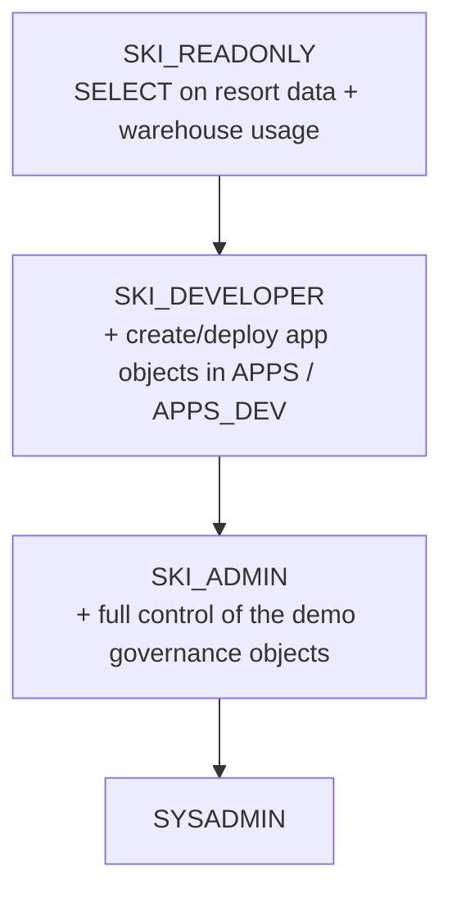

# Governance — DCM project for the Ski Resort demo

This directory is the **single source of truth for everything *around* the data**:
the roles, the shared warehouse, the app schemas, and the grants that let people
and pipelines read the data and deploy apps. It is managed with **DCM (Database
Change Management)** so the account's governance state is declarative,
version-controlled, and reviewable in a pull request — not a pile of ad‑hoc SQL.

It does **not** define the data itself. The tables, views, and Cortex Analyst
semantic views in `SKI_RESORT_DEMO` already exist; this project only manages the
access layer on top of them.

---

## What is DCM and what role does it play here?

[DCM](https://docs.snowflake.com/en/user-guide/snowflake-cli/dcm/overview) lets
you declare Snowflake objects in files and converge an account to that
declaration:

- `snow dcm plan` → shows the **diff** between the files and the live account
  (what would be created/altered/dropped) without changing anything.
- `snow dcm deploy` → **applies** that diff so the account matches the files.

Why we use it for this template:

- **Repeatable** — a teammate (or a fresh account) gets the identical role
  hierarchy, warehouse, and schemas by running one command.
- **Reviewable** — governance changes arrive as a PR; CI posts the `plan` so a
  reviewer sees exactly what will change before it's merged.
- **Auditable** — the intended state lives in git, not in someone's worksheet
  history.

DCM owns the *declarative, current-object* governance. A small set of grants that
DCM intentionally does **not** manage (FUTURE grants, semantic-view grants,
Cortex Agent grants, and account-level SPCS privileges) live in
[`post_deployment_grants.sql`](post_deployment_grants.sql) — see below.

---

## Project layout

| File | Purpose |
|------|---------|
| [`manifest.yml`](manifest.yml) | DCM project definition: the deploy **target** (`MAIN`), the project name, and the **templating** values (`db`, `wh_size`, `demo_user`) substituted into the `DEFINE` files. |
| [`sources/definitions/roles.sql`](sources/definitions/roles.sql) | The three-tier account-role hierarchy + assigns the demo user a working role. |
| [`sources/definitions/schemas.sql`](sources/definitions/schemas.sql) | The `APPS` and `APPS_DEV` schemas (where app objects get deployed). |
| [`sources/definitions/warehouse.sql`](sources/definitions/warehouse.sql) | The single shared `SKI_DEMO_WH` warehouse. |
| [`sources/definitions/grants.sql`](sources/definitions/grants.sql) | Declarative grants on **current** objects (warehouse/db/schema USAGE, `SELECT ON ALL`, `CREATE`). |
| [`post_deployment_grants.sql`](post_deployment_grants.sql) | Grants DCM can't/shouldn't manage — run as ACCOUNTADMIN **after** `deploy`. |

The `DEFINE` files use `{{ ... }}` placeholders (`{{ db }}`, `{{ wh_size }}`,
`{{ demo_user }}`) that DCM fills from the `templating` block in `manifest.yml`.

---

## What this project creates

### Role hierarchy (one role set — no `_DEV`/`_PROD` suffixes)

Privileges flow **up** the chain, so a parent role inherits everything its
children can do:



We use **account roles** (not database roles) because every tier needs warehouse
USAGE, and warehouses are account-level objects that database roles can't be
granted.

### Environments at the **app layer** (not separate databases)

There is one read-only data database, `SKI_RESORT_DEMO`. Because the data is
identical everywhere, environments are just *which schema an app deploys into*:

| Environment | Schema | Used by |
|-------------|--------|---------|
| production | `APPS` | the apps consumers use (merge to `main`) |
| dev / feature branch | `APPS_DEV` | ephemeral per-branch app objects (push a branch) |

### Compute

A single `SKI_DEMO_WH` (XS, auto-suspend 60s) shared by all app instances — the
workload is a small read-only dashboard, so one warehouse is plenty.

---

## Declarative grants vs. `post_deployment_grants.sql`

| Lives in `grants.sql` (DCM-managed) | Lives in `post_deployment_grants.sql` (manual / CI, run as ACCOUNTADMIN) |
|---|---|
| Warehouse `USAGE`/`OPERATE` | `SELECT ON FUTURE TABLES/VIEWS` (covers objects added later) |
| Database + schema `USAGE` | `SELECT ON ALL/FUTURE SEMANTIC VIEWS` (Cortex Analyst) |
| `SELECT ON ALL TABLES/VIEWS` (current) | `USAGE ON AGENT` for the Cortex Agents (RESORT_EXECUTIVE, SKI_OPS_ASSISTANT) |
| `CREATE TABLE/VIEW/STAGE` in `APPS`/`APPS_DEV` | Account-level SPCS privileges for `SKI_DEVELOPER` (CREATE COMPUTE POOL, BIND SERVICE ENDPOINT, CREATE INTEGRATION) + `CREATE STREAMLIT/WORKSPACE/APPLICATION SERVICE/ARTIFACT REPOSITORY/SERVICE/IMAGE REPOSITORY` |

**Why the split?** FUTURE grants and semantic-view grants are outside DCM's
supported declarative grant set (and DCM best practice is to keep declarative
grants to current objects). The SPCS/App-Runtime deploy privileges are
account-level and can't be granted from DCM's database-scoped context. Keeping
them in one clearly-labeled script makes the "what DCM does NOT manage" explicit.

---

## How CI uses this (`.github/workflows/dcm-deploy.yml`)

Triggered only when `governance/**` changes:

- **On a PR** → `snow dcm plan --target MAIN` and posts the diff for review.
- **On merge to `main`** → `snow dcm deploy --target MAIN`.

CI connects as **ACCOUNTADMIN** using the GitHub secrets
(`SNOWFLAKE_ACCOUNT` / `SNOWFLAKE_USER` / `SNOWFLAKE_PRIVATE_KEY_RAW`) via the
nested `SNOWFLAKE_CONNECTIONS_DEFAULT_*` env shape. The `account_identifier` in
`manifest.yml` is a **safety check** — it must match the account the connection
points at, which is why it stays a real value (see the "change to your account"
note in the manifest) rather than a placeholder.

---

## Run it yourself

```bash
# 1) Preview the changes (no-op diff)
snow dcm plan --target MAIN -c <your-connection>

# 2) Apply the declarative governance (roles, warehouse, APPS/APPS_DEV, grants)
snow dcm deploy --target MAIN -c <your-connection>

# 3) Apply the grants DCM doesn't manage (FUTURE / semantic views / agents / SPCS)
snow sql -f governance/post_deployment_grants.sql \
  -D "DB=SKI_RESORT_DEMO" -c <your-connection>
```

> **Before you deploy:** edit `manifest.yml` and set `account_identifier` and
> `demo_user` to your own account and Snowflake user(s).

---

## Extend it

1. Add or change a `DEFINE` in the relevant `sources/definitions/*.sql`
   (or add a new grant to `grants.sql`).
2. Open a PR — CI runs `snow dcm plan` so you and a reviewer see the exact diff.
3. Merge — CI runs `snow dcm deploy` against target `MAIN`.

If your change needs a FUTURE/semantic/agent/account-level grant, add it to
`post_deployment_grants.sql` instead (DCM won't manage those).

See [`../docs/ARCHITECTURE.md`](../docs/ARCHITECTURE.md) for how this governance
layer fits the overall framework, and [`../docs/PIPELINE_SETUP.md`](../docs/PIPELINE_SETUP.md)
to wire up the GitHub secrets/variables/environments.
